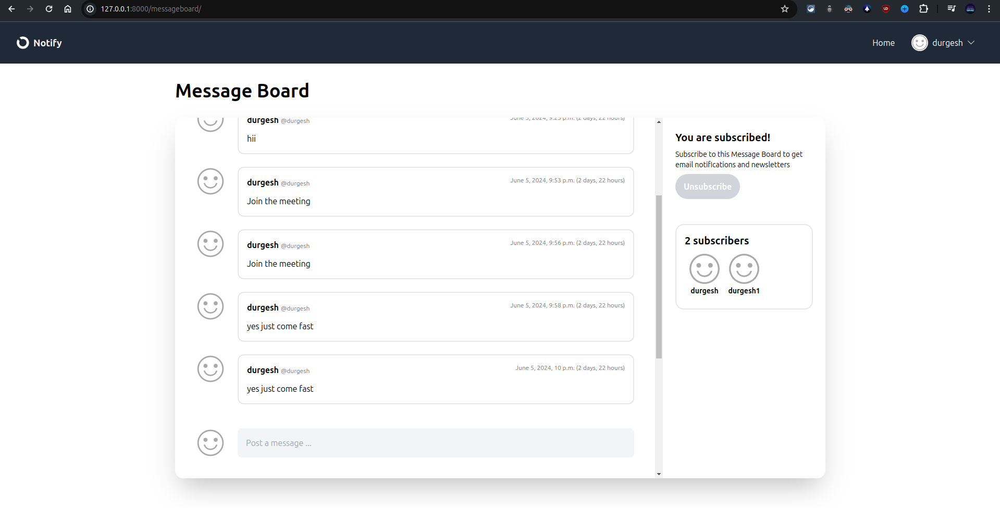

# Notify

Notify is a message board application that leverages Celery for email notifications and threading for handling concurrency. This project aims to provide an efficient and scalable platform for managing and sending notifications.
Click here to explore <a href="https://github.com/durgeshmehar/Message-Board">Notify</a> website.


## Features
- Developed an email notification system to manage a high-volume subscriber base.
- Asynchronously sending a large number of emails to subscribers using Celery.
- Utilized threading for improved concurrency and performance.
- Implement OAuth (Sign with Google) authentication for improving security and user experience.

## Technologies
- **Django** - A high-level Python web framework that encourages rapid development and clean, pragmatic design.
- **Celery** - An asynchronous task queue/job queue based on distributed message passing.
- **Threading** - Used for improving concurrency and performance.
- **OAuth** - Implemented for Sign in with Google authentication.

## Screenshots


## Local Installation

1. **Clone the Repository**
   ```shell
   git clone https://github.com/durgeshmehar/Message-Board.git
2. **Create and Activate a Virtual Environment**
   ```shell
   python -m venv venv
   source venv/bin/activate  # On Windows use `venv\Scripts\activate
    ```
3. **Install the Dependencies**
   ```shell
   cd Message-Board
   pip install -r requirements.txt
   ```
4. **Run the Development Server**
    ```shell
    python manage.py runserver
    ```
## Usage
1. Ensure the development server is running.
2. Open your browser and navigate to http://127.0.0.1:8000 to access the Blog application.
## Contributing
Contributions are welcome! Please fork the repository and create a pull request with your changes.